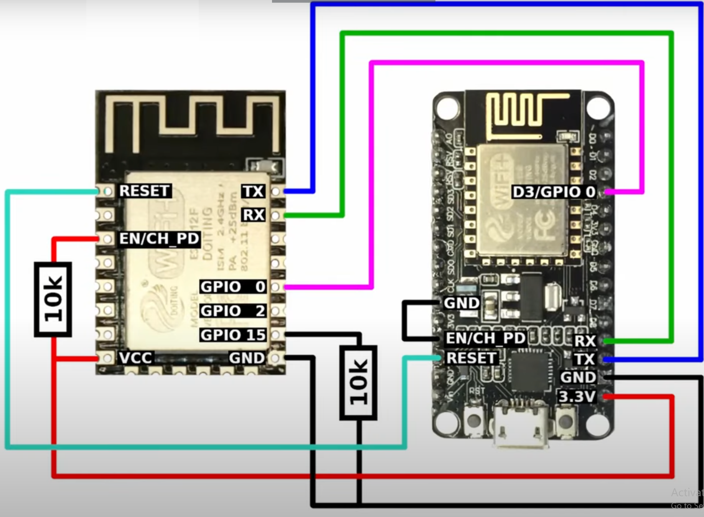

# Valve Controller

A WiFi-enabled valve controller with a basic UI, powered by an ESP-12F integrated with a relay board.

## Features
- Web-based control interface
- Manual and automatic valve operation
- WebSocket communication for real-time updates
- Shift register-based relay control
- Multi-network WiFi connection support

## Hardware Setup
### Relay Board
The ESP-12F is integrated with a relay board to control multiple valves.

### Programming the ESP-12F
Use the following wiring scheme to program the ESP-12F:

## User Interface
The system includes a web-based UI for monitoring and controlling valve states.

### Manual Control
- Only one valve can be turned on at a time.
- Clicking a valve button turns off all others.

### Automatic Control
- When activated, the system cycles through the valves sequentially.
- Each valve stays open for a specified duration before switching to the next.

### Installation
1. Flash the provided firmware to the ESP8266.
2. Ensure the wiring matches the relay board and programming setup.
3. Connect the ESP-12F to a WiFi network.
4. Access the web interface through the assigned IP address.
